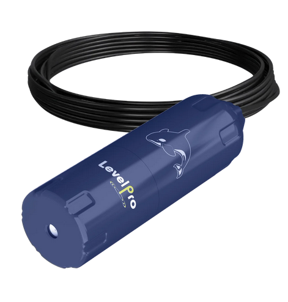

# FloatLevel
Piezoelectric Submersible Level Sensor using ESP32

This project is based on the ESP32, it works with a Submersible Level Sensor 4-20ma Pressure Sensors.

|<a href="https://www.aliexpress.com/item/32826540261.html?src=google&src=google&albch=shopping&acnt=494-037-6276&isdl=y&slnk=&plac=&mtctp=&albbt=Google_7_shopping&aff_platform=google&aff_short_key=UneMJZVf&&albagn=888888&albcp=7386552844&albag=80241711349&trgt=743612850714&crea=en32826540261&netw=u&device=c&albpg=743612850714&albpd=en32826540261&gclid=Cj0KCQjw-r71BRDuARIsAB7i_QMqV6A_E4zdDcSiXs2j3qIUm4cIgdCFfkDs1Egmak4QgCXrvfcQXAkaAu2WEALw_wcB&gclsrc=aw.ds"> ESP32 Dev Module</a>||
|---|---|
|<a href="https://www.amazon.ca/Submersible-Pressure-Sensors-Transmitter-Detector/dp/B0C448QTPV/ref=sr_1_4?crid=3CJBD6RVJBXIN&dib=eyJ2IjoiMSJ9.-c4XDq79iyTpaMJEcIONxg6ZYhjfyJE7SA4uxqeZePKyQjjeDzo3SH5cLsPx5ghm_VEf8Ub5_hHfM4VFpO-rCBVYFWDvaoBf8b4YlDWAFkldA8fKzpWkDEDY8zQPxDDhIctZy2XMjohPo_U5Vc8ERiVTV-V5IM52brOpZwNNLQ4GcR5GBQZfZPUmkFMXJaQntatI7UmpWTgs9PQfwXFRMiKZSPG2ig8dzkgWiYOdhCCiE_pXHoOVFQTN9eYNN8R848bcikWC7MRxHCkisC_0IO3i41ul8x2lBzO33FopJoc2uRtDa1qwxfmarhE3uoWHq6JymuPkQ9EhDo2CgxyJD2C4di87L1yWubGMS-ZI_i2iO2f7LLxIZVXNeUF0DhqjNlSqql03UUnpc2AgPD1qtKYhSGKWdEgXE7L7Ae6jdSLrULCPj6ewRcWuKJM82-TK.-IQH48So9kr3tc-yNsUj39FTi4GGFmpREAOUC7myftA&dib_tag=se&keywords=Piezoelectric%2BSubmersible%2BLevel%2BSensor&qid=1737633768&sprefix=piezoelectric%2Bsubmersible%2Blevel%2Bsensor%2Caps%2C132&sr=8-4&th=1"> Piezoelectric Submersible Level Sensor </a>||

## Wiring

Device Pin | ESP32 |
--- | --- |
FloatLevel red (signal)  | A0 |
Use 160 Ohm resister from A0 to GND
FloatLevel black (Gnd) | 24VDC | Gnd |

  

Used the following development tools;

<ul>
  <li>Visual Studio Code with the PlatformIO extension.</li>
  <li>***** Don't forget to upload the index.htm file for the initial setup of the ESP32, Run 'Upload File System Image' platformio command</li>
  <li>Setup WIFI configuration by logging onto the "FloatLevel" Access Point, use "FloatLevel" as the AP password. Browse 192.168.4.1 and go to Configuration Page to provide your WIFI credentials.
</ul>

